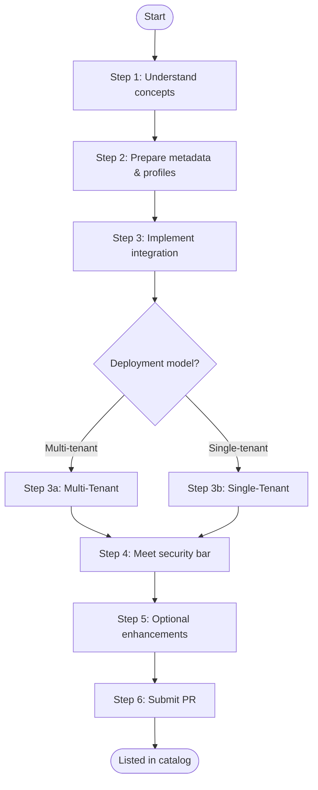

# IBM Sovereign Core public catalog

## Why list your product on IBM Sovereign Core

Digital sovereignty is no longer a niche requirement. Governments, financial institutions, healthcare organizations, and managed service providers across the globe are under increasing pressure to demonstrate that the software running in their environments meets strict standards for data residency, operational control, compliance, and AI governance. IBM Sovereign Core was built to be the platform those buyers trust — and the catalog is how your product gets in front of them.

**The market opportunity is real and growing.** IBM Sovereign Core is now generally available and already deployed across regulated industries in multiple regions, with partners including AMD, Cloudera, Mistral AI, Palo Alto Networks, MongoDB, and Deloitte. The catalog is the primary discovery surface for every customer and managed service provider evaluating what runs inside their sovereign environment. A listing puts your product directly in that evaluation process.

**A catalog listing is a seller claim, not just a listing.** Each integration level comes with a specific, permitted claim — "Validated on Sovereign Core," "Catalog compatible," "Integrated," or "Premium." These are the exact phrases IBM sellers, MSP sales teams, and procurement evaluators use when responding to regulated tenders and sovereignty mandates. Without a listing, your product cannot be referenced in those conversations with any backing. With one, your product has a verifiable, IBM-reviewed entry point into every Sovereign Core opportunity.

**You get reach without rebuilding.** The same listing simultaneously populates the public-facing catalog at ibm.com, the in-platform catalog available inside every Sovereign Core deployment worldwide, and the BYOP provisioning engine that MSPs use to offer your software as a managed service to their tenants. One PR, three surfaces, every deployment.

**The bar is defined and the path is fast.** A Level 1 validation can be achieved in approximately five business days once intake inputs are complete. You do not need to complete a full platform integration to get your product listed and your sellers unblocked. The catalog is designed to let you enter at the right level for your current readiness and deepen the integration over time as the opportunity justifies it.

**For MSPs, the catalog is a product catalog for your customers.** The platform catalog is a curated, centrally controlled service registry that your administrators govern and your tenants self-serve from. Onboarding your own software or a partner's software into the catalog means your customers get a repeatable, one-click provisioning experience — rather than a bespoke installation that no one can maintain at version three.

---

## Table of contents

1. [Introducing the Sovereign Core catalog](#introducing-the-sovereign-core-catalog)
2. [The four integration levels](#the-four-integration-levels)
   - [Level 1 — Validated](#level-1--validated)
   - [Level 2 — BYOP (Bring Your Own Product)](#level-2--byop-bring-your-own-product)
   - [Level 3 — Integrated](#level-3--integrated)
   - [Level 4 — Premium](#level-4--premium)
3. [The 5 pillars of sovereign attributes](#the-5-pillars-of-sovereign-attributes)
4. [Repository structure](#repository-structure)
5. [Asset lifecycle states](#asset-lifecycle-states)
6. [Contribution flow & lifecycle](#contribution-flow--lifecycle)
   - [Three-stage partner contribution — Submitting a pull request (PR)](#three-stage-partner-contribution--submitting-a-pull-request-pr)
7. [BYOP products onboarding](#byop-products-onboarding)
   - [Platform building blocks](#platform-building-blocks)
   - [Onboarding journey](#onboarding-journey)
   - [Step 1 — Choose your deployment model](#step-1--choose-your-deployment-model)
   - [Step 2a — Single-tenant integration](#step-2a--single-tenant-integration)
   - [Step 2b — Multi-tenant integration](#step-2b--multi-tenant-integration)
   - [Step 3 — Broker implementation options](#step-3--broker-implementation-options)
   - [Step 4 — Security requirements](#step-4--security-requirements)
   - [Steps 5, 6 & 7 — Optional enhancements](#steps-5-6--7--optional-enhancements)
   - [Step 8 — Submitting your pull request (PR)](#step-8--submitting-your-pull-request-pr)
   - [Coming soon](#coming-soon)
8. [Roles and responsibilities (RACI)](#roles-and-responsibilities-raci)
9. [Complete catalog guide](#complete-catalog-guide)

---

## Introducing the Sovereign Core catalog

There are three catalog surfaces in Sovereign Core and understanding them is essential before you begin onboarding.

1. **Public catalog** — the externally visible storefront at [www.ibm.com/products/sovereign-core/catalog/en](https://www.ibm.com/products/sovereign-core/catalog/en/)
2. **Catalog Git repository** — the governed, public source of truth at [github.com/IBM/sovereign-core-catalog](https://github.com/IBM/sovereign-core-catalog)
3. **Platform catalog** — the in-platform deployment engine inside every Sovereign Core deployment

The **public catalog** is where partners, ISVs, and IBM product teams publish their listings. It is backed by the public Git repository at github.com/IBM/sovereign-core-catalog. All entries are structured YAML validated by CI on every pull request. Partners contribute via PR, IBM reviews and merges, and the result is a governed, auditable record of every listed product.

The **platform catalog** is the in-platform deployment engine available inside every deployed Sovereign Core environment. It consumes the same listings from the public catalog and makes them available to service providers and tenants for one-click provisioning. A listing in the public catalog automatically becomes available in the platform catalog once approved.

> **Design principle:** The repository stores only metadata, compliance pointers, and deployment references. No binaries, no secrets, no product code. All actual artifacts remain in vendor-owned OCI registries.

---

## The four integration levels

A product enters the catalog at one of four integration levels. The level describes the depth of platform integration, the evidence required, and the permitted seller claim.

### Level 1 — Validated

The minimum entry level. The product is discoverable in the catalog and confirmed to run on Sovereign Core. Installation and day-two operations remain the responsibility of the product team. Validation is performed either by the Sovereign Core SRE team or by the partner providing documented proof. The permitted seller claim is "Validated on Sovereign Core." This level is achievable in approximately five business days once intake inputs are complete. It is the right entry point for a product with an active customer opportunity that will deepen its platform integration over time.

### Level 2 — BYOP (Bring Your Own Product)

The product has been installed on a supported Sovereign Core configuration using a repeatable, tested procedure and is available via the BYOP mechanism in both the Central IT catalog and the Tenant Catalog. A runbook, version matrix, and upgrade approach are required. The permitted seller claim is "Catalog compatible on Sovereign Core." Target timeline is two to three weeks from the point where installation assets are ready.

### Level 3 — Integrated

The product is deployed from the catalog and connected to the platform services required for normal operation — identity, secrets, observability, metering, and lifecycle management — with tested recovery procedures in place. The permitted seller claim is "Integrated with Sovereign Core." This takes four to eight weeks depending on integration gaps and requires funded engineering effort from the owning team.

### Level 4 — Premium

Sovereign Core owns the end-to-end experience from provisioning through day-two operations, upgrade, rollback, and recovery. This is the standard to which watsonx is held as the first target product. The permitted seller claim is "Premium on Sovereign Core." Milestones are agreed at intake because this is a funded joint engineering commitment between the product team and Sovereign Core, requiring long-term commitment from both sides. Unified support is a defining characteristic of a Premium listing — it must be agreed and in place before go-live, not defined afterward.

> **Important:** The integration level is not the same as the sovereignty posture of the product, and the two should not be conflated. A Level 2 listing can have an excellent sovereignty profile — air-gapped, offline activation, customer-held keys — while a Level 4 product may still have external dependencies that need to be managed. Sovereignty posture is assessed separately, and it is what an auditor or regulated buyer will ask about.

---

## The 5 pillars of sovereign attributes

### Pillar 1 — Sovereignty & legal jurisdiction
- Corporate HQ & ultimate parent HQ
- Air-gap capability declaration
- External dependency endpoints (must be empty or redirectable)
- SBOM format & base image provenance

### Pillar 2 — Kubernetes architecture & day-2
- Delivery mechanism (Helm / Operator / Kustomize)
- Target Kubernetes & OCP versions
- CSI access modes & snapshot support
- Node selectors & resource guarantees

### Pillar 3 — Security & infrastructure isolation
- Pod Security Standard (`restricted` / `baseline` / `privileged`)
- Read-only root filesystem
- RBAC scope (namespace-isolated vs cluster-wide)
- FIPS 140-3 compliance
- KMS / HSM integration

### Pillar 4 — Compliance, auditing & certification
- Framework attestations (BSI-C5, SecNumCloud, FedRAMP, Gaia-X)
- Verifiable credentials from third-party auditors
- Structured audit log output (stdout/stderr JSON)
- OpenTelemetry / FluentBit SIEM mapping

### Pillar 5 — Ecosystem & commercial models
- Offline / disconnected licensing (BYOL or Marketplace-Metered)
- Offline licence validation mechanism
- Support personnel security clearance level
- Remote access prohibition declaration (no inbound VPN / reverse tunnel)

> All sovereignty claims are **self-declared by the vendor**. IBM does not independently audit or certify any claim. Customers are responsible for independent validation before deployment.

---

## Repository structure

Two-step model: company identity first, component listing second.

```
sovereign-core-catalog/
├── .github/workflows/            # CI validation — runs on every PR
├── companies/                    # WHO you are — one profile per organisation
│   └── <company-slug>/
│       └── profile.yaml          # Jurisdiction, certifications, contact
├── components/                   # WHAT you are listing
│   ├── software/                 # K8s operators, Helm charts, apps
│   │   └── <company>/<product>/
│   │       ├── <version>/
│   │       │   └── metadata.yaml
│   │       └── sovereigncore_ext/helm/
│   │           └── values-mapping.yaml   # One-click deploy overlay
│   ├── ai-models/                # Foundation models & weights
│   │   └── <company>/<model>/
│   │       └── metadata.yaml
│   ├── hardware/                 # GPUs, servers, storage, HSMs
│   │   └── <company>/<product>/
│   │       └── profile.yaml
│   └── services/                 # MSPs, hosting, SI, audit partners
│       └── <company>/
│           └── profile.yaml
├── schemas/                      # JSON Schema — one per resource kind
├── scripts/                      # Local validation before opening PR
└── docs/                         # Governance, onboarding, and briefing docs
```

> **The two-step rule:** Every partner must first submit a `companies/<slug>/profile.yaml` PR and have it merged before any component listing will pass CI validation. The `companyRef` field in every metadata file must resolve to an existing company profile.

---

## Asset lifecycle states

Every catalog entry carries a `lifecycleStatus` field that controls the Public Catalog visibility and deployment eligibility. Transitions are enforced by the CI pipeline — a PR cannot set `approved` directly without passing through `review` first.

```
                    ┌─────────────────────────────────────────────────────┐
                    │                                                     │
   Partner          │  CI pass +        IBM reviewer      Owner marks    │  Removed from
   submits PR       │  IBM queued       approves &        end-of-life    │  active feed;
       │            │  for review       merges PR              │         │  retained for
       ▼            │      │                │                  ▼         │  audit
   ┌───────┐        │  ┌────────┐      ┌──────────┐      ┌────────────┐  │  ┌─────────┐
   │ Draft │ ──────►│  │ Review │─────►│ Approved │─────►│ Deprecated │──┼─►│ Retired │
   └───────┘        │  └────────┘      └──────────┘      └────────────┘  │  └─────────┘
       ▲            │      │                                              │
       └────────────┼──────┘                                              │
     Review         │  Changes requested                                  │
     feedback       └─────────────────────────────────────────────────────┘
```

| State | Storefront | Deployable | Description |
|---|---|---|---|
| `draft` | Hidden | No | Entry submitted, CI validation pending |
| `review` | Hidden | No | CI passed, awaiting IBM reviewer approval |
| `approved` | Public | Yes | Merged to main, visible in the Public Catalog |
| `deprecated` | Visible with warning | Discouraged | End-of-life signalled, successor available |
| `retired` | Hidden | No | Removed from active catalog, retained for audit |

---

## Contribution flow & lifecycle

### Asset lifecycle states

```
Draft → Review → Approved → Deprecated → Retired
  │        │         │           │            │
Partner  CI pass  IBM merges  Owner flags  Removed from
submits  queued   PR          end-of-life  feed; retained
PR       for                              for audit
         review
```

### Three-stage partner contribution — Submitting a pull request (PR)

**Stage 1 — Join: submit your company profile**
Fork repo → create `companies/<your-slug>/profile.yaml` → run `./scripts/validate-local.sh` → open PR titled `[Company Join] Your Company Name`. Must be merged before any component PR.

**Stage 2 — List: propose a component**
Create `components/<type>/<your-slug>/<product>/<version>/metadata.yaml` → validate locally → open PR titled `[New Listing] Software: Acme — ProductName v1.0`. CI validates schema automatically.

**Stage 3 — Maintain: keep your listing current**
New version? Add a new `<version>/` folder via PR. Deprecating? Update `lifecycleStatus: deprecated`. Withdrawing? Set `lifecycleStatus: retired`. All changes via PR — never direct push to main.

> **CI validation runs automatically on every PR** — schema correctness, required fields, taxonomy vocabulary, secrets scan, broken reference check. Human IBM review only after CI passes.

---

## BYOP products onboarding

This section covers the technical integration steps for teams bringing a product to the catalog via the BYOP (Bring Your Own Product) mechanism. It applies to both IBM product teams and external partners targeting Level 2 or higher.

### Platform building blocks

| Concept | What it is |
|---|---|
| **Public catalog** | A public-facing website where customers and MSPs discover partner offerings — software, hardware, services, and models. |
| **Public GitHub repository** | The master data source for the catalog. All listings are submitted and updated via pull request. |
| **Sovereign Core platform catalog** | An in-platform catalog inside each Sovereign Core deployment. MSP and Central IT administrators use it to curate which services are available to their tenants. |
| **BYOP broker & provisioning** | The "Bring Your Own Product" broker, backed by ArgoCD and a customer-supplied GitOps repository. This is how MSPs operationalize software and offer it as a managed service to tenants. |

### Onboarding journey



### Step 1 — Choose your deployment model

Before implementing the integration, determine how your software serves multiple customers:

**Single-tenant service** — A dedicated, isolated copy of your software is deployed per tenant into that tenant's own Kubernetes namespace or cluster. This is the simpler model and the recommended starting point for most products.

**Multi-tenant service** — Your software is installed once into "Tenant 0" resources. Each customer tenant maps to a logical instance within that shared installation. This model requires a Service Broker implementation.

### Step 2a — Single-tenant integration

1. Use the platform-supplied BYOP broker (preferred for standard Helm-based workloads) or implement a custom broker for special provisioning logic.
2. The broker deploys your software into the tenant-specific cluster using the customer's GitOps repository as the delivery mechanism.

**Provisioning flow:** MSP enables service for Tenant X → Sovereign Core Catalog triggers BYOP broker → broker deploys software via GitOps into tenant cluster → tenant receives a dedicated instance.

### Step 2b — Multi-tenant integration

1. **Automate installation to Tenant 0** — Use the BYOP process to deploy the shared service infrastructure. Strongly recommended for operational consistency.
2. **Implement a Service Broker** — The broker is called each time a service provider provisions a new tenant. It creates the tenant-to-instance mapping within your software. Follow the Open Service Broker API specification.

**Provisioning flow:** MSP enables service for a tenant → Sovereign Core Catalog triggers BYOP broker → broker calls `POST /v2/service_instances/{id}` → service broker creates tenant mapping → tenant has access.

### Step 3 — Broker implementation options

| Option | Best for | What it requires |
|---|---|---|
| **Out-of-the-box BYOP Broker** *(v1.2+)* | Single-tenant Helm workloads | No broker code — configure chart repo, chart name, and values schema |
| **Custom broker** *(any release)* | Multi-tenant or complex provisioning | Implement the full OSB API from scratch |

**Out-of-the-box BYOP Broker** — The fastest path for Helm-based single-tenant deployments. No broker code required. Additional workload types (e.g. Operator-based) are planned for upcoming releases.

**Custom broker** — Full control over provisioning logic. Implement `/v2/catalog`, `/v2/service_instances`, and `/v2/service_bindings`. Required for multi-tenant services that need custom tenant lifecycle management.

### Step 4 — Security requirements

Security is a mandatory gate — not optional.

- All container images and dependencies must have zero critical or high CVEs.
- All images must be sourced from a trusted registry (e.g. `registry.redhat.io`).
- Follow IBM secure-by-default standards: no hardcoded secrets, non-root containers, TLS 1.2 or higher throughout.
- Automated vulnerability scans must be integrated into your CI/CD pipeline before submission.

### Steps 5, 6 & 7 — Optional enhancements

Not required for initial listing, but strongly recommended for a complete managed-service experience:

| Enhancement | Why it matters |
|---|---|
| **Metering interface** | Enables usage-based billing and chargeback reporting for MSPs and their tenants. |
| **Sovereign Core IAM integration** | Single sign-on and RBAC via the platform identity provider — no separate user directory needed. |
| **Logging & metrics** | Integrates your service with the platform's log aggregation and metrics stack for unified MSP monitoring. |

### Step 8 — Submitting your pull request (PR)

To appear in the catalog, submit a pull request to the Public GitHub Repository. Your PR must include:

- **Company profile** — name, logo, contact details, description
- **Software profile** — product name, version, category, description
- **Technical metadata** — air-gap support, supported architectures, resource requirements
- **Sovereign Core integration artefacts** — see deployment model section below

For steps on how to submit a PR, reference the [Three-stage partner contribution — Submitting a pull request (PR)](#three-stage-partner-contribution--submitting-a-pull-request-pr) section.

### Coming soon

**Application compliance declaration and continuous automated compliance** — A forthcoming capability that will allow software teams to declare their compliance posture and have it continuously verified within the Sovereign Core platform.

## Roles and responsibilities (RACI)

Understanding who is responsible for each aspect of the onboarding and ongoing operation keeps teams aligned and avoids gaps after go-live.

| Responsibility | BYOP software provider | IBM Sovereign Core team | Sovereign Core customer |
|---|---|---|---|
| Design, define, and implement software integration with Sovereign Core | ✅ Responsible | Supportive | — |
| Provide technical support to Sovereign Core customers using the BYOP software | ✅ Responsible | — | — |
| Maintain and support custom broker and deployment code (when non-OOTB broker is used) | ✅ Responsible | — | — |
| Provide technical support to BYOP software providers on Sovereign Core integration topics | Consulted | ✅ Responsible | — |
| Leverage the BYOP software to further refine, tailor, and deliver the service to tenants/customers | — | — | ✅ Responsible |

---

## Complete catalog guide

For more details on onboarding, reference the [Sovereign Core catalog onboarding guide](docs/catalog-onboarding-guide.md).
