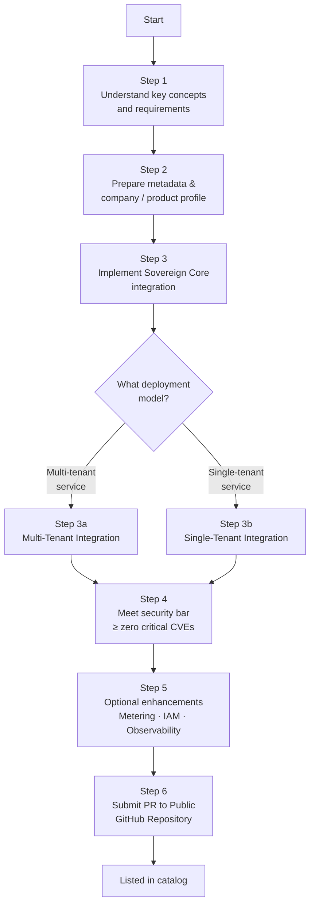

# IBM Sovereign Core public catalog

## Why list your product on IBM Sovereign Core

Digital sovereignty is no longer a niche requirement. Governments, financial institutions, healthcare organizations, and managed service providers across the globe are under increasing pressure to demonstrate that the software running in their environments meets strict standards for data residency, operational control, compliance, and AI governance. IBM Sovereign Core was built to be the platform those buyers trust — and the catalog is how your product gets in front of them.

**The market opportunity is real and growing.** IBM Sovereign Core is now generally available and already deployed across regulated industries in multiple regions, with partners including AMD, Cloudera, Mistral AI, Palo Alto Networks, MongoDB, and Deloitte. The catalog is the primary discovery surface for every customer and managed service provider evaluating what runs inside their sovereign environment. A listing puts your product directly in that evaluation process.

**A catalog listing is a seller claim, not just a listing.** Each integration level comes with a specific, permitted claim — "Validated on Sovereign Core," "Catalog compatible," "Integrated," or "Premium." These are the exact phrases IBM sellers, MSP sales teams, and procurement evaluators use when responding to regulated tenders and sovereignty mandates. Without a listing, your product cannot be referenced in those conversations with any backing. With one, your product has a verifiable, IBM-reviewed entry point into every Sovereign Core opportunity.

**You get reach without rebuilding.** The same listing simultaneously populates the public-facing catalog at ibm.com, the in-platform catalog available inside every Sovereign Core deployment worldwide, and the BYOP provisioning engine that MSPs use to offer your software as a managed service to their tenants. One PR, three surfaces, every deployment.

**The bar is defined and the path is fast.** A Level 1 validation can be achieved in approximately five business days once intake inputs are complete. You do not need to complete a full platform integration to get your product listed and your sellers unblocked. The catalog is designed to let you enter at the right level for your current readiness and deepen the integration over time as the opportunity justifies it.

**For MSPs, the catalog is a product catalog for your customers.** The platform catalog is a curated, centrally controlled service registry that your administrators govern and your tenants self-serve from. Onboarding your own software or a partner's software into the catalog means your customers get a repeatable, one-click provisioning experience — rather than a bespoke installation that no one can maintain at version three.

---

## Table of contents

1. [Introducing the Sovereign Core catalog](#introducing-the-sovereign-core-catalog)
2. [The four integration levels](#the-four-integration-levels)
3. [The 5 pillars of sovereign attributes](#the-5-pillars-of-sovereign-attributes)
4. [Repository structure](#repository-structure)
5. [Asset lifecycle states](#asset-lifecycle-states)
6. [Contribution flow & lifecycle — Submitting a pull request (PR)](#contribution-flow--lifecycle--submitting-a-pull-request-pr)
7. [BYOP products onboarding](#byop-products-onboarding)
8. [Roles and responsibilities (RACI)](#roles-and-responsibilities-raci)
9. [Complete catalog guide](#complete-catalog-guide)

---

## Introducing the Sovereign Core catalog

There are three catalog surfaces in Sovereign Core and understanding them is essential before you begin onboarding.

1. **Public catalog** — the externally visible storefront at [www.ibm.com/products/sovereign-core/catalog/en](https://www.ibm.com/products/sovereign-core/catalog/en/)
2. **Catalog Git repository** — the governed, public source of truth at [github.com/IBM/sovereign-core-catalog](https://github.com/IBM/sovereign-core-catalog)
3. **Platform catalog** — the in-platform deployment engine inside every Sovereign Core deployment

The **public catalog** is where partners, ISVs, and IBM product teams publish their listings. It is backed by the public Git repository at github.com/IBM/sovereign-core-catalog. All entries are structured YAML validated by CI on every pull request. Partners contribute via PR, IBM reviews and merges, and the result is a governed, auditable record of every listed product.

The **platform catalog** is the in-platform deployment engine available inside every deployed Sovereign Core environment. It consumes the same listings from the public catalog and makes them available to service providers and tenants for one-click provisioning. A listing in the public catalog automatically becomes available in the platform catalog once approved.

> **Design principle:** The repository stores only metadata, compliance pointers, and deployment references. No binaries, no secrets, no product code. All actual artifacts remain in vendor-owned OCI registries.

---

## The four integration levels

A product enters the catalog at one of four integration levels. The level describes the depth of platform integration, the evidence required, and the permitted seller claim.

| Level | Name | Permitted claim | Typical timeline |
|---|---|---|---|
| 1 | Validated | "Validated on Sovereign Core" | ~5 business days |
| 2 | BYOP (Bring Your Own Product) | "Catalog compatible on Sovereign Core" | 2–3 weeks |
| 3 | Integrated | "Integrated with Sovereign Core" | 4–8 weeks |
| 4 | Premium | "Premium on Sovereign Core" | Agreed at intake |

> The integration level is not the same as the sovereignty posture of the product. Sovereignty posture is assessed separately. See the [catalog onboarding guide](docs/catalog-onboarding-guide.md#the-four-integration-levels) for full descriptions of each level.

---

## The 5 pillars of sovereign attributes

Every listing is assessed across five pillars: sovereignty & legal jurisdiction, Kubernetes architecture & day-2, security & infrastructure isolation, compliance & auditing, and ecosystem & commercial models. All sovereignty claims are self-declared by the vendor — IBM does not independently audit or certify any claim.

See the [catalog onboarding guide](docs/catalog-onboarding-guide.md#the-5-pillars-of-sovereign-attributes) for the full attribute list across all five pillars.

---

## Repository structure

Two-step model: company identity first, component listing second.

```
sovereign-core-catalog/
├── .github/workflows/            # CI validation — runs on every PR
├── companies/                    # WHO you are — one profile per organisation
│   └── <company-slug>/
│       └── profile.yaml          # Jurisdiction, certifications, contact
├── components/                   # WHAT you are listing
│   ├── software/                 # K8s operators, Helm charts, apps
│   │   └── <company>/<product>/
│   │       ├── <version>/
│   │       │   └── metadata.yaml
│   │       └── sovereigncore_ext/helm/
│   │           └── values-mapping.yaml   # One-click deploy overlay
│   ├── ai-models/                # Foundation models & weights
│   │   └── <company>/<model>/
│   │       └── metadata.yaml
│   ├── hardware/                 # GPUs, servers, storage, HSMs
│   │   └── <company>/<product>/
│   │       └── profile.yaml
│   └── services/                 # MSPs, hosting, SI, audit partners
│       └── <company>/
│           └── profile.yaml
├── schemas/                      # JSON Schema — one per resource kind
├── scripts/                      # Local validation before opening PR
└── docs/                         # Governance, onboarding, and briefing docs
```

> **The two-step rule:** Every partner must first submit a `companies/<slug>/profile.yaml` PR and have it merged before any component listing will pass CI validation. The `companyRef` field in every metadata file must resolve to an existing company profile.

---

## Asset lifecycle states

Every catalog entry carries a `lifecycleStatus` field that controls visibility and deployment eligibility. Transitions are enforced by the CI pipeline — a PR cannot set `approved` directly without passing through `review` first.

| State | Storefront | Deployable | Description |
|---|---|---|---|
| `draft` | Hidden | No | Entry submitted, CI validation pending |
| `review` | Hidden | No | CI passed, awaiting IBM reviewer approval |
| `approved` | Public | Yes | Merged to main, visible in the Public Catalog |
| `deprecated` | Visible with warning | Discouraged | End-of-life signalled, successor available |
| `retired` | Hidden | No | Removed from active catalog, retained for audit |

---

## Contribution flow & lifecycle — Submitting a pull request (PR)

### Three-stage partner contribution

**Stage 1 — Join: submit your company profile**
Fork repo → create `companies/<your-slug>/profile.yaml` → run `./scripts/validate-local.sh` → open PR titled `[Company Join] Your Company Name`. Must be merged before any component PR.

**Stage 2 — List: propose a component**
Create `components/<type>/<your-slug>/<product>/<version>/metadata.yaml` → validate locally → open PR titled `[New Listing] Software: Acme — ProductName v1.0`. CI validates schema automatically.

**Stage 3 — Maintain: keep your listing current**
New version? Add a new `<version>/` folder via PR. Deprecating? Update `lifecycleStatus: deprecated`. Withdrawing? Set `lifecycleStatus: retired`. All changes via PR — never direct push to main.

> **CI validation runs automatically on every PR** — schema correctness, required fields, taxonomy vocabulary, secrets scan, broken reference check. Human IBM review only after CI passes.

---

## BYOP products onboarding

The BYOP (Bring Your Own Product) mechanism lets any IBM product team, MSP, or ISV make their software available for one-click provisioning inside every Sovereign Core deployment. The high-level journey is below — for the full technical walkthrough, see the [catalog onboarding guide](docs/catalog-onboarding-guide.md#byop-products-onboarding).



## Roles and responsibilities (RACI)

Understanding who is responsible for each aspect of the onboarding and ongoing operation keeps teams aligned and avoids gaps after go-live.

| Responsibility | BYOP software provider | IBM Sovereign Core team | Sovereign Core customer |
|---|---|---|---|
| Design, define, and implement software integration with Sovereign Core | ✅ Responsible | Supportive | — |
| Provide technical support to Sovereign Core customers using the BYOP software | ✅ Responsible | — | — |
| Maintain and support custom broker and deployment code (when non-OOTB broker is used) | ✅ Responsible | — | — |
| Provide technical support to BYOP software providers on Sovereign Core integration topics | Consulted | ✅ Responsible | — |
| Leverage the BYOP software to further refine, tailor, and deliver the service to tenants/customers | — | — | ✅ Responsible |

---

## Complete catalog guide

For more details on onboarding, reference the [Sovereign Core catalog onboarding guide](docs/catalog-onboarding-guide.md).
