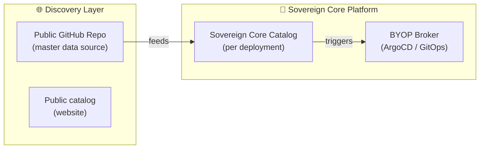
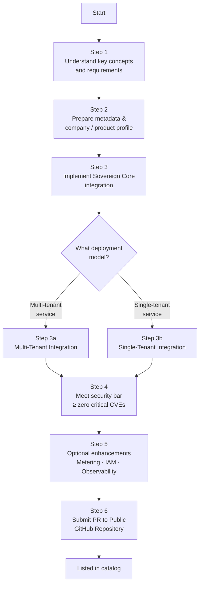
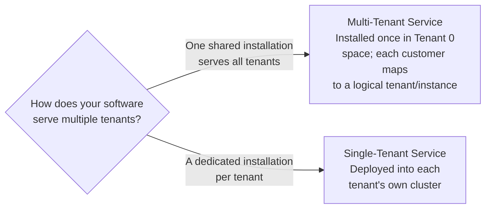
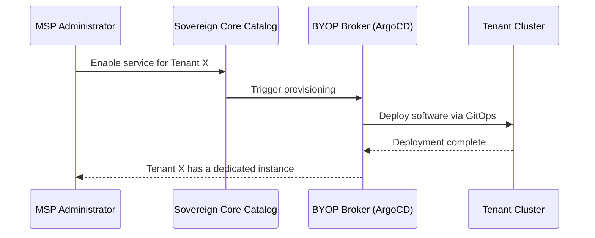
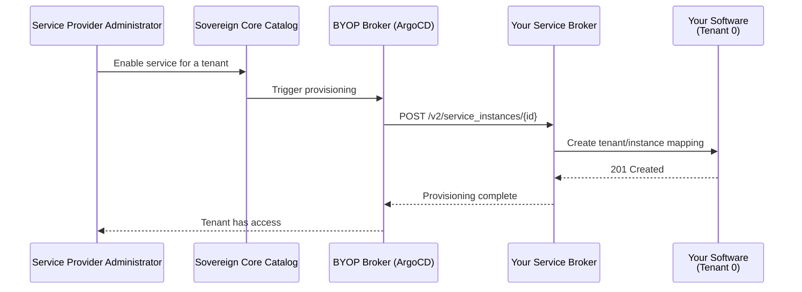
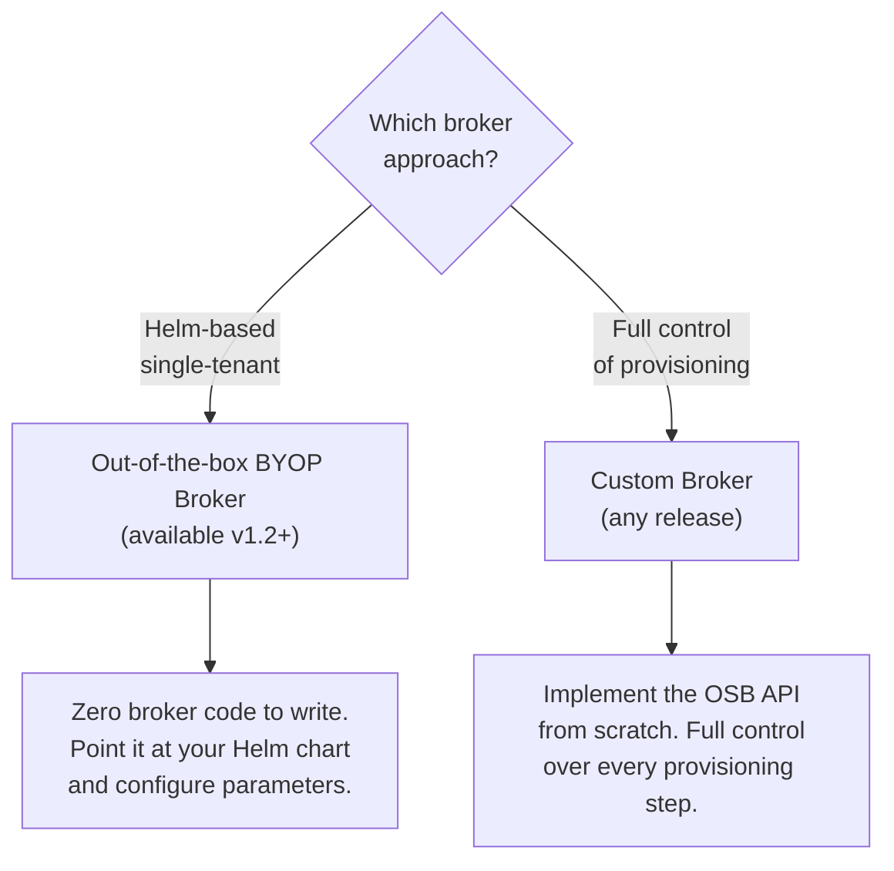

# IBM Sovereign Core — Catalog onboarding guide

For business partners, ISVs, and IBM product teams. IBM product teams should also refer to the internal addendum for additional guidelines specific to IBM offerings.

---

## Table of contents

1. [About this guide](#about-this-guide)
2. [Why the catalog exists](#why-the-catalog-exists)
3. [Who can onboard](#who-can-onboard)
4. [Introducing the Sovereign Core catalog](#introducing-the-sovereign-core-catalog)
5. [The four integration levels](#the-four-integration-levels)
6. [Additional checks beyond the level](#additional-checks-beyond-the-level)
7. [The 5 pillars of sovereign attributes](#the-5-pillars-of-sovereign-attributes)
8. [How to start — the onboarding stages](#how-to-start--the-onboarding-stages)
9. [What the team commits to](#what-the-team-commits-to)
10. [BYOP products onboarding](#byop-products-onboarding)
11. [Repository structure](#repository-structure)
12. [Asset lifecycle states](#asset-lifecycle-states)
13. [Get in touch](#get-in-touch)

---

## About this guide

The IBM Sovereign Core catalog is the governed route for any product, service, AI model, or blueprint that runs on the platform. This guide covers everything a team needs to know before and during onboarding: how the four integration levels are structured and what each one requires, how to navigate the onboarding process from initial conversation through to publication, what the platform validates automatically and what requires human review, and what ongoing obligations come with a published listing.

It is written for IBM product teams, managed service providers, ISVs, and business partners — anyone evaluating whether to list, preparing to submit, or looking to understand what they are committing to.

---

## Why the catalog exists

IBM Sovereign Core is only as valuable as what runs on it. A platform without a growing, trustworthy set of services on top of it is an infrastructure story, not a solution story. The catalog is how that set grows in a way that keeps the sovereignty claim credible and verifiable — with every listing backed by evidence that stays current as both the product and the platform evolve.

---

## Who can onboard

Any product that can run on CNCF-conformant Kubernetes (including OpenShift) without requiring changes to the Sovereign Core control plane is a candidate — whether it is software, a blueprint, an AI model served through the platform inference runtime, or a service such as migration or compliance validation. The one non-negotiable requirement is an active owner: a team that will maintain currency, respond to vulnerabilities, and ensure compatibility with each new platform release. A short list of well-maintained entries is more valuable than a long list that no one trusts.

---

## Introducing the Sovereign Core catalog

There are three catalog surfaces in Sovereign Core and understanding them is essential before you begin onboarding.

1. **Public catalog**
2. **Catalog Git repo**
3. **Platform catalog in a Sovereign Core deployment**

The **public catalog** ([www.ibm.com/products/sovereign-core/catalog](https://www.ibm.com/products/sovereign-core/catalog/en/)) is the externally visible storefront where partners, ISVs, and IBM product teams publish their listings. It is backed by a public Git repository at github.com/IBM/sovereign-core-catalog. All entries are structured YAML validated by CI on every pull request. Partners contribute via PR, IBM reviews and merges, and the result is a governed, auditable record of every listed product.

The **platform catalog** is the in-platform deployment engine available inside every deployed Sovereign Core environment. It consumes the same listings from the public catalog and makes them available to service providers and tenants for one-click provisioning. A listing in the public catalog automatically becomes available in the platform catalog once approved.

> **Design principle:** The repository stores only metadata, compliance pointers, and deployment references. No binaries, no secrets, no product code. All actual artifacts remain in vendor-owned OCI registries.

Browse the public catalog at [www.ibm.com/products/sovereign-core/catalog/en](https://www.ibm.com/products/sovereign-core/catalog/en/)

---

## The four integration levels

A product enters the catalog at one of four integration levels. The level describes the depth of platform integration, the evidence required, and the permitted seller claim. The levels are independent architectural patterns — not a ladder. A product can enter at any level and is not required to progress through lower levels first. You can build straight to Level 4 without ever implementing a Level 2 design.

> **Important:** The integration level is not the same as the sovereignty posture of the product. A Level 2 listing can have an excellent sovereignty profile — air-gapped, offline activation, and customer-held keys — while a Level 4 product may still have external dependencies that need to be managed. Sovereignty posture is assessed separately and is what an auditor or regulated buyer will ask about.

### Level 1 — Validated

The minimum entry level. The product is discoverable in the catalog and confirmed to run on Sovereign Core. Installation and day-two operations remain the responsibility of the product team. Validation is performed either by the Sovereign Core SRE team or by the partner providing documented proof.

**Permitted claim:** "Validated on Sovereign Core"
**Typical timeline:** Approximately five business days once intake inputs are complete.

This is the right entry point for a product team with an active customer opportunity or that wants to create future opportunities with the lowest initial investment. The product team can decide later whether to deepen the product's integration in Sovereign Core.

### Level 2 — BYOP (Bring Your Own Product)

The product has been installed on a supported Sovereign Core configuration using a repeatable, tested procedure and is available via the BYOP mechanism in both the service provider catalog and the platform catalog. A runbook, version matrix, and upgrade approach are required.

**Permitted claim:** "Catalog compatible on Sovereign Core"
**Typical timeline:** Two to three weeks from the point where installation assets are ready.

### Level 3 — Integrated

The product is deployed from the catalog and connected to the platform services required for normal operation — identity, secrets, observability, metering, and lifecycle management — with tested recovery procedures in place.

**Permitted claim:** "Integrated with Sovereign Core"
**Typical timeline:** Four to eight weeks depending on integration gaps. Requires funded engineering effort from the owning team.

### Level 4 — Premium

Sovereign Core owns the end-to-end experience from provisioning through day-two operations, upgrade, rollback, and recovery. This represents the deepest level of platform commitment and is the standard to which watsonx is held as the first target product.

**Permitted claim:** "Premium on Sovereign Core"
**Typical timeline:** Milestones agreed at intake. This is a funded joint engineering commitment between the product team and Sovereign Core, requiring long-term commitment from both sides.

Unified support is a defining characteristic of a Premium listing — it must be agreed and in place before go-live, not defined afterward.

---

## Additional checks beyond the level

The integration level alone does not tell a buyer everything they need to know. Three dimensions are assessed independently of the level.

**Sovereignty profile** — Whether the product can operate inside the sovereign boundary without leaking control, telemetry, or data custody. This covers external runtime dependencies, phone-home behavior, offline license activation, key custody, and the jurisdiction of support personnel who would access the system. The result is a published profile alongside the level: `sovereign-ready`, `conditional`, or `connected-only`. This is the dimension that directly differentiates Sovereign Core from a standard platform catalog.

**Multi-tenancy** — The primary buyer in the Sovereign Core target market is a central IT group or managed service provider hosting workload for multiple tenants. We assess per-tenant isolation, per-tenant metering, and whether the product's license explicitly permits multi-tenant operation. License gaps are more efficiently resolved during the onboarding pipeline than after a partner's first customer deal.

**Commercial readiness** — For Level 3 and Level 4 listings, a named business unit sponsor is required. A documented customer pipeline is strongly recommended and will be requested during the intake period. Strategic exceptions may be considered at the discretion of the IBM Sovereign Core team. This ensures the engineering investment on both sides is justified and that the listing will be actively maintained after publication.

---

## The 5 pillars of sovereign attributes

> All sovereignty claims are **self-declared by the vendor**. IBM does not independently audit or certify any claim. Customers are responsible for independent validation before deployment.

### Pillar 1 — Sovereignty & legal jurisdiction
- Corporate HQ and ultimate parent HQ
- Air-gap capability declaration
- External dependency endpoints (must be empty or redirectable)
- SBOM format and base image provenance

### Pillar 2 — Kubernetes architecture & day-2
- Delivery mechanism (Helm / Operator / Kustomize)
- Target Kubernetes and OCP versions
- CSI access modes and snapshot support
- Node selectors and resource guarantees

### Pillar 3 — Security & infrastructure isolation
- Pod Security Standard (`restricted` / `baseline` / `privileged`)
- Read-only root filesystem
- RBAC scope (namespace-isolated vs cluster-wide)
- FIPS 140-3 compliance
- KMS / HSM integration

### Pillar 4 — Compliance, auditing & certification
- Framework attestations (BSI-C5, SecNumCloud, FedRAMP, Gaia-X)
- Verifiable credentials from third-party auditors
- Structured audit log output (stdout/stderr JSON)
- OpenTelemetry / FluentBit SIEM mapping

### Pillar 5 — Ecosystem & commercial models
- Offline / disconnected licensing (BYOL or Marketplace-Metered)
- Offline license validation mechanism
- Support personnel security clearance level
- Remote access prohibition declaration (no inbound VPN / reverse tunnel)

---

## How to start — the onboarding stages

There is a single onboarding process regardless of target level. The target level changes the evidence and the engineering work required. It does not create a separate queue or a separate set of reviewers.

### Stage 0 — Pre-review

Before any formal onboarding begins, a brief pre-review confirms the commercial motion, identifies the right go-to-market model, and ensures legal, support, a technical sponsor, and a funding source are in place. This conversation typically takes thirty minutes and prevents significantly longer discussions later when these foundations are undefined.

Supported commercial motions include:
- IBM resell via OEM or royalty agreement
- IBM co-sell
- Partner resell via royalty or ESA
- Partner co-sell
- MSP resell or bring-your-own-license

### Stage 1 — Intake and business review

The requesting team presents with a named product PM, an engineering focal, a named executive sponsor, and documented evidence of customer demand or active seller pipeline. The review determines not just whether the product can be integrated, but whether it should be, at what level, and who owns it going forward.

The output is one of four decisions: proceed with a named level, target sovereignty profile, owners, release date, and currency commitment; hold in the backlog; decline; or route to BYOP.

### Stage 2 — Build and validate

The product team submits a manifest — a structured declaration of deployment type, lifecycle status, sovereignty attributes, and tenancy model. The automated pipeline runs packaging checks, security scanning, installation and lifecycle tests, and sovereignty checks. The output is a list of gaps to address, not a pass/fail verdict. Most products go through one or two iterations before reaching readiness review. That is expected and accounted for in the timeline.

### Stage 3 — Readiness review

A biweekly review panel examines exceptions and confirms the level the product has actually earned. The permitted seller claim is generated directly from the review record — catalog copy is not written separately.

### Stage 4 — Publication and currency

The product goes live with a catalog entry, an entitlement and metering integration, an active support path, and a named currency owner. Currency is an ongoing obligation: the product team re-validates on every product release and on every Sovereign Core release for as long as the listing is published. The platform team owns the validation profile; the product team owns everything else.

---

## What the team commits to

A catalog listing is not a one-time activity. The obligations that come with it are the reason the claim carries weight.

- **Named owners:** The product team maintains three named contacts — product PM, engineering focal, and executive sponsor — from intake through the life of the listing. These individuals are accountable for keeping installation assets, documentation, and the current version matrix.
- **Ongoing re-validation:** The product team re-validates on every product release and on every Sovereign Core platform release. Critical vulnerabilities on a published listing carry a defined remediation window; missing it results in suspension of the listing.
- **Platform compatibility:** The Sovereign Core team maintains backward compatibility and provides advance notice through a formal deprecation process to minimize disruption to listed products.
- **Sponsorship for Levels 3 and 4:** Level 3 and Level 4 listings require active business unit sponsorship. Without it, listings become a maintenance burden and will be flagged for review or suspension.
- **Pipeline and catalog operations:** IBM Sovereign Core funds and operates the validation pipeline and catalog infrastructure. Partners are responsible for everything related to their own listing.

---

## BYOP products onboarding

This section covers the technical integration steps for teams bringing a product to the catalog via the BYOP (Bring Your Own Product) mechanism. It applies to both IBM product teams and external partners targeting Level 2 or higher.

### Platform building blocks

| Concept | What it is |
|---|---|
| **Public catalog** | A public-facing website where customers and MSPs discover partner offerings — software, hardware, services, and models. |
| **Public GitHub repository** | The master data source for the catalog. All listings are submitted and updated via pull request. |
| **Sovereign Core platform catalog** | An in-platform catalog inside each Sovereign Core deployment. MSP and Central IT administrators use it to curate which services are available to their tenants. |
| **BYOP broker & provisioning** | The "Bring Your Own Product" broker, backed by ArgoCD and a customer-supplied GitOps repository. This is how MSPs operationalize software and offer it as a managed service to tenants. |

### Onboarding journey

### Submit your listing — GitHub pull request

To appear in the catalog, submit a pull request to the public GitHub repository at [github.com/IBM/sovereign-core-catalog](https://github.com/IBM/sovereign-core-catalog). For PR format and structure, refer to the [proposing a component guide](https://github.com/IBM/sovereign-core-catalog/blob/main/docs/proposing-a-component.md) in the public repository. Your PR must include:

- **Company profile** — name, logo, contact details, description
- **Software profile** — product name, version, category, description
- **Technical metadata** — air-gap support, supported architectures, resource requirements
- **Sovereign Core integration artifacts** — see deployment model section below

### Step 3 — Choose your deployment model

Before implementing the integration, determine how your software serves multiple customers. Even if your application supports a multi-tenant model, the recommended deployment approach is ultimately up to you as the software provider — consider your architecture, operational complexity, and customer requirements when choosing.

**Single-tenant service** — A dedicated, isolated copy of your software is deployed per tenant into that tenant's own Kubernetes cluster.

**Multi-tenant service** — Your software is installed once into "platform tenant" resources. Each customer tenant maps to a logical instance within that shared installation. This model requires a Service Broker implementation.

### Step 3a — Single-tenant integration

- Use the platform-supplied BYOP broker (preferred for standard Helm-based workloads) or implement a custom broker for special provisioning logic.
- The broker deploys your software into the tenant-specific cluster using the customer's GitOps repository as the delivery mechanism.

### Step 3b — Multi-tenant integration

- **Automate installation to platform tenant** — Use the BYOP process to deploy the shared service infrastructure. Strongly recommended for operational consistency.
- **Implement a Service Broker** — The broker is called each time a service provider provisions a new tenant. It creates the tenant-to-instance mapping within your software. Follow the Open Service Broker API specification.

### Step 3 — Broker implementation options

| Option | Best for | What it requires |
|---|---|---|
| **Out-of-the-box BYOP Broker** *(v1.2+)* | Single-tenant Helm workloads | No broker code — configure chart repo, chart name, and values schema |
| **Custom broker** *(any release)* | Multi-tenant or complex provisioning | Implement the full OSB API from scratch |

**Out-of-the-box BYOP Broker** — The fastest path for Helm-based single-tenant deployments. No broker code required. Additional workload types (e.g. Operator-based) are planned for upcoming releases.

**Custom broker** — Full control over provisioning logic. Implement `/v2/catalog`, `/v2/service_instances`, and `/v2/service_bindings`. Required for multi-tenant services that need custom tenant lifecycle management.

### Step 4 — Security requirements

Security is a mandatory gate — not optional.

- All container images and dependencies must have zero critical or high CVEs.
- All images must be sourced from a trusted registry (e.g. `registry.redhat.io`).
- Follow IBM secure-by-default standards: no hardcoded secrets, non-root containers, TLS 1.2 or higher throughout.
- Automated vulnerability scans must be integrated into your CI/CD pipeline before submission.

### Steps 5, 6 & 7 — Optional enhancements

Not required for initial listing, but required for Level 3 (Integrated) and strongly recommended for a complete managed-service experience:

| Enhancement | Why it matters |
|---|---|
| **Metering interface** | Enables usage-based billing and chargeback reporting for MSPs and their tenants. |
| **Sovereign Core IAM integration** | Single sign-on and RBAC via the platform identity provider — no separate user directory needed. |
| **Logging & metrics** | Integrates your service with the platform's log aggregation and metrics stack for unified MSP monitoring. |

### Coming soon

**Application compliance declaration and continuous automated compliance** — A forthcoming capability that will allow software teams to declare their compliance posture and have it continuously verified within the Sovereign Core platform.

### Roles and responsibilities (RACI)

Understanding who is responsible for each aspect of the onboarding and ongoing operation keeps teams aligned and avoids gaps after go-live.

| Responsibility | BYOP software provider | IBM Sovereign Core team | Sovereign Core customer |
|---|---|---|---|
| Design, define, and implement software integration with Sovereign Core | ✅ Responsible | Supportive | — |
| Provide technical support to Sovereign Core customers using the BYOP software | ✅ Responsible | — | — |
| Maintain and support custom broker and deployment code (when non-OOTB broker is used) | ✅ Responsible | — | — |
| Provide technical support to BYOP software providers on Sovereign Core integration topics | Consulted | ✅ Responsible | — |
| Leverage the BYOP software to further refine, tailor, and deliver the service to tenants/customers | — | — | ✅ Responsible |

---

## Repository structure

Two-step model: company identity first, component listing second.

> **The two-step rule:** Every partner must first submit a `companies/<slug>/profile.yaml` PR and have it merged before any component listing will pass CI validation. The `companyRef` field in every metadata file must resolve to an existing company profile.

### Contribution lifecycle

**Step 1 — Join:** Fork the repo → create `companies/<your-slug>/profile.yaml` → run `./scripts/validate-local.sh` → open a PR titled `[Company Join] Your Company Name`. This must be merged before any component PR will pass CI.

**Step 2 — List:** Create `components/<type>/<your-slug>/<product>/<version>/metadata.yaml` → validate locally → open a PR titled `[New Listing] Software: Your Company — Product Name v1.0`. CI validates schema automatically.

**Step 3 — Maintain:** New version? Add a new `<version>/` folder via PR. Deprecating? Update `lifecycleStatus: deprecated`. Withdrawing? Set `lifecycleStatus: retired`. All changes go via PR — never a direct push to main.

> **CI validation runs automatically on every PR:** schema correctness, required fields, taxonomy vocabulary, secrets scan, and broken reference checks. Human IBM review takes place only after CI passes.

---

## Asset lifecycle states

Every catalog entry carries a `lifecycleStatus` field that controls visibility and deployment eligibility. State transitions are enforced by the CI pipeline — a PR cannot be approved directly without first passing through `review`.

| State | Storefront | Deployable | Description |
|---|---|---|---|
| `draft` | Hidden | No | Entry submitted, CI validation in progress |
| `review` | Hidden | No | CI passed, awaiting IBM reviewer approval |
| `approved` | Public | Yes | Merged to main, visible in the public catalog |
| `deprecated` | Visible with warning | Discouraged | End-of-life signalled; successor available |
| `retired` | Hidden | No | Removed from active catalog; retained for audit |

---

## Get in touch

To start an onboarding conversation or ask a question about catalog listing, reach out to the IBM Sovereign Core product team:

- **Email:** sovereign-core-catalog@ibm.com
- **IBM partner portal:** [ibm.com/partnerworld](https://www.ibm.com/partnerworld)
- **Public GitHub repository:** [github.com/IBM/sovereign-core-catalog](https://github.com/IBM/sovereign-core-catalog)

The team runs a biweekly readiness review. New onboarding requests submitted before the Friday prior to a review date will be considered for that cycle.

