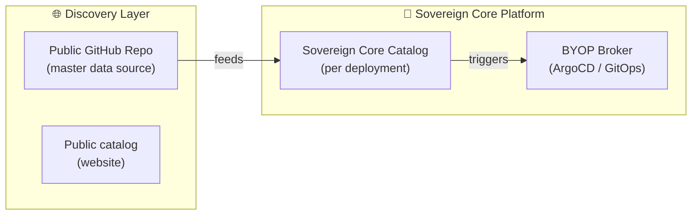
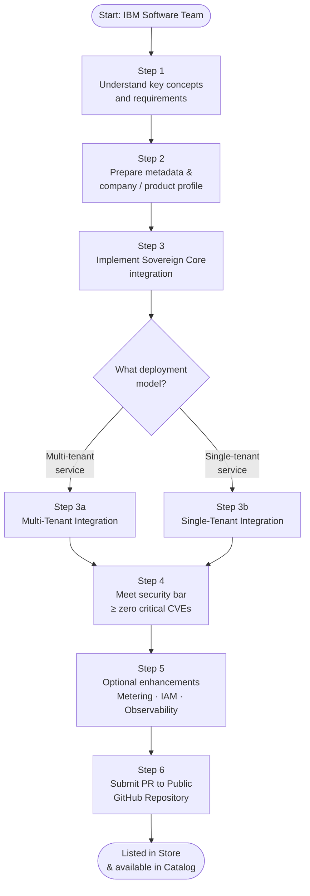
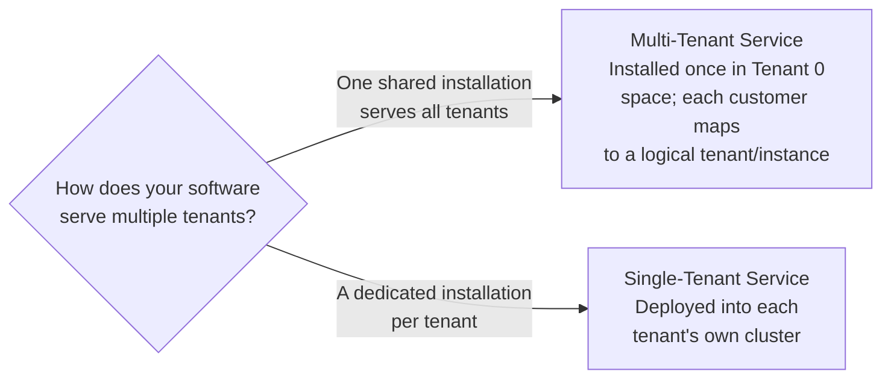
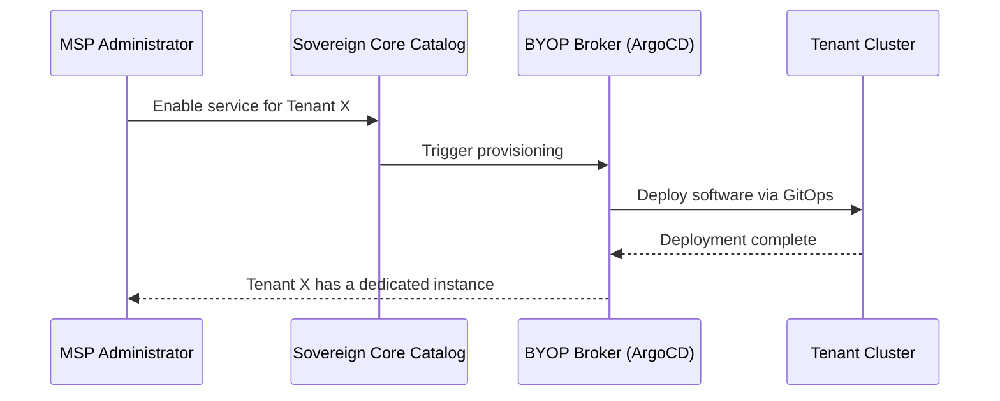
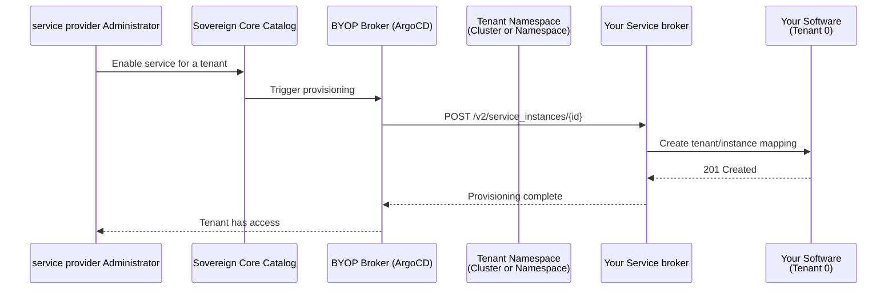
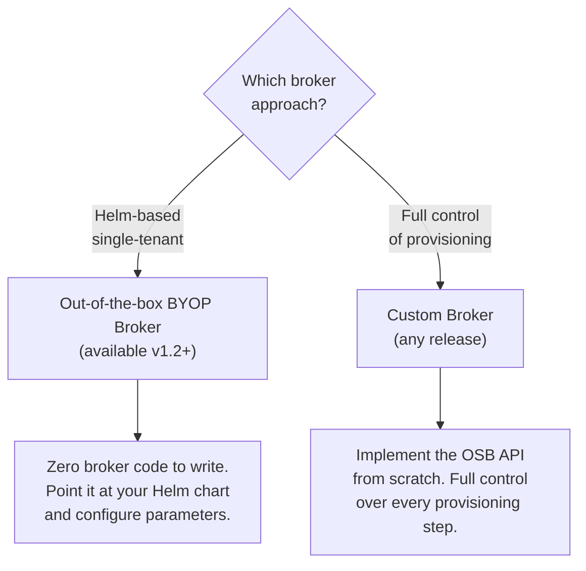

# How to onboard your IBM Software into the Sovereign Core catalog

**IBM Sovereign Core** is an open platform — any IBM product team, managed service provider (MSP), or independent software vendor (ISV) can list their solution in the catalog and make it available to Sovereign Core customers. This guide walks you through the **Bring Your Own Product (BYOP)** onboarding process: from understanding how the platform works, through the technical integration, to submitting your pull request and going live. Once listed, Sovereign Core customers and MSPs can discover your solution, provision it for their tenants, and deliver it as a managed service — without any bespoke integration work on their end. The process is straightforward, and the time to complete it will vary depending on your product's architecture and existing packaging.

## Contents

- [1. Understand the Key Concepts](#1-understand-the-key-concepts)
- [2. The Onboarding Journey: High-Level Flow](#2-the-onboarding-journey-high-level-flow)
- [3. Get Listed — GitHub Pull Request Process](#3-get-listed--github-pull-request-process)
- [4. Implement the Sovereign Core Integration](#4-implement-the-sovereign-core-integration)
  - [4.1 Choose Your Deployment Model](#41-choose-your-deployment-model)
  - [4.2 Single-Tenant Service Integration](#42-single-tenant-service-integration)
  - [4.3 Multi-Tenant Service Integration](#43-multi-tenant-service-integration)
  - [4.4 Broker Implementation Options](#44-broker-implementation-options)
- [5. Meet the Security Bar](#5-meet-the-security-bar)
- [6. Optional Enhancements](#6-optional-enhancements)
- [7. Future Capability](#7-future-capability)
- [8. Roles and Responsibilities (RACI)](#8-roles-and-responsibilities-raci)

---

## 1. Understand the Key Concepts

Before you start, familiarise yourself with the four building blocks of the Sovereign Core ecosystem.

|Concept | What it is |
|---|---|
| **Public catalog** | A public-facing website listing partner offerings (software, hardware, services). This replaces the existing IBM Sovereign Core ecosystem page. Customers and managed service providers (MSPs) discover solutions here. |
| **Public GitHub repository** | The master data source for the catalog, maintained by IBM. Your team submits a pull request (PR) to list or update your company profile and solution catalogue entry. |
| **Sovereign Core platform catalog** | An in-platform catalogue inside each Sovereign Core deployment. Managed service provider or Central IT administrators use it to curate which services are available to their tenants. |
| **BYOP broker & provisioning** |"Bring Your Own Product" broker backed by ArgoCD (hub/spoke topology) and a customer-supplied GitOps repository. This is how managed service providers operationalize software and offer it as a managed service to tenants. |

---

## 2. The Onboarding Journey: High-Level Flow

---

## 3. Get Listed — GitHub Pull Request Process

To appear in the catalog and become available in the Sovereign Core Catalog, you must submit a **pull request** (PR) to the [Public GitHub Repository](https://github.com/IBM/sovereign-core-catalog).

Your PR must include:

- **Company profile** — name, logo, contact, description
- **Software profile** — product name, version, category, description
- **Technical metadata** — e.g. air-gap support, supported architectures, resource requirements
- **Sovereign Core integration artefacts** — see Section 4 below

For PR format and structure, refer to the [proposing a component guide](https://github.com/IBM/sovereign-core-catalog/blob/main/docs/proposing-a-component.md) in the public repository.

---

## 4. Implement the Sovereign Core Integration

This is the core technical work. Your integration requirements depend on your **deployment model**.

### 4.1 Choose Your Deployment Model

Even if your application supports a multi-tenant model, the recommended deployment approach is ultimately up to you as the software provider. Consider your architecture, operational complexity, and customer requirements when choosing.

### 4.2 Single-Tenant Service Integration

A dedicated, isolated copy of your software is deployed **per tenant** into that tenant's own Kubernetes cluster.

**Key steps:**

1. Use the **BYOP broker supplied** (preferred for standard deployments) or implement a **custom broker** if you need special provisioning logic.
2. The broker deploys your software into the tenant-specific cluster using the customer's GitOps repository as the delivery mechanism.

### 4.3 Multi-Tenant Service Integration

Your software is installed **once** into "Tenant 0" resources (VMs, Kubernetes, or a mix). Each end-customer tenant maps to a logical service instance within that shared installation.

**Key steps:**

1. **Automate installation to Tenant 0** — Use the BYOP process to deploy the shared service infrastructure. This step is optional but strongly recommended.
2. **Implement a Service Broker** — When a service provider provisions a new tenant, the broker is called to create a tenant/service-instance mapping inside your software. Follow the Open Service Broker API specification.

### 4.4 Broker Implementation Options

There are two paths for implementing the broker component. Choose based on your deployment model and how much control you need over the provisioning experience.

#### Option 1 — Out-of-the-box BYOP Broker _(v1.2+, recommended for single-tenant Helm workloads)_

The platform ships a built-in broker starting in **v1.2**. If your software is packaged as a Helm chart, this is the fastest path to integration — no broker code required.

- Supports Helm-based single-tenant deployments out of the box
- Driven by configuration (chart repo, chart name, values schema)
- More capabilities (e.g. operator-based workloads) planned in upcoming releases

#### Option 2 — Custom Broker _(any release)_

Build your own broker when you need complete control over provisioning logic, automation, or the end-user service experience.

- Implement the OSB API (`/v2/catalog`, `/v2/service_instances`, `/v2/service_bindings`)
- Full flexibility: call any API, run any automation, integrate with your own backend systems
- Required for multi-tenant services that need custom tenant/instance lifecycle management

---

## 5. Meet the Security Bar

Security is a **mandatory gate** — not optional.

- Target **zero critical or high vulnerabilities** (CVEs) in all container images and dependencies.
- All images must come from a trusted registry (e.g. `registry.redhat.io`).
- Follow IBM secure-by-default standards: no hardcoded secrets, non-root containers, TLS 1.2+ everywhere.
- Run automated vulnerability scans as part of your CI/CD pipeline before submission.

---

## 6. Optional Enhancements

These are not required for initial listing, but strongly recommend them to deliver a complete managed-service experience.

| Enhancement | Why it matters |
|---|---|
| **Metering Interface** | Enables usage-based billing and chargeback reporting for MSPs and their tenants. |
| **Sovereign Core IAM Integration** | Single sign-on and RBAC using the platform identity provider — removes the need for a separate user directory. |
| **Logging & Metrics** | Integrate with the platform's log aggregation and metrics stack so MSPs can monitor your service alongside the rest of their platform. |

---

## 7. Future Capability

> 🔮 **Application Compliance Declaration & Continuous Automated Compliance** — a forthcoming capability that will allow software teams to declare their compliance posture and have it continuously verified within the Sovereign Core platform. Stay tuned.

---
## 8. Roles and Responsibilities (RACI)

Understanding who is responsible for each aspect of the onboarding and ongoing operation keeps teams aligned and avoids gaps after go-live.

| Responsibility | BYOP software provider | IBM Sovereign Core team | Sovereign Core customer |
|---|---|---|---|
| Design, define, and implement software integration with Sovereign Core | ✅ Responsible | Supportive | — |
| Provide technical support to Sovereign Core customers using the BYOP software | ✅ Responsible | — | — |
| Maintain and support custom broker and deployment code (when non-OOTB broker is used) | ✅ Responsible | — | — |
| Provide technical support to BYOP software providers on Sovereign Core integration topics | Consulted | ✅ Responsible | — |
| Leverage the BYOP software to further refine, tailor, and deliver the service to tenants/customers | — | — | ✅ Responsible |

